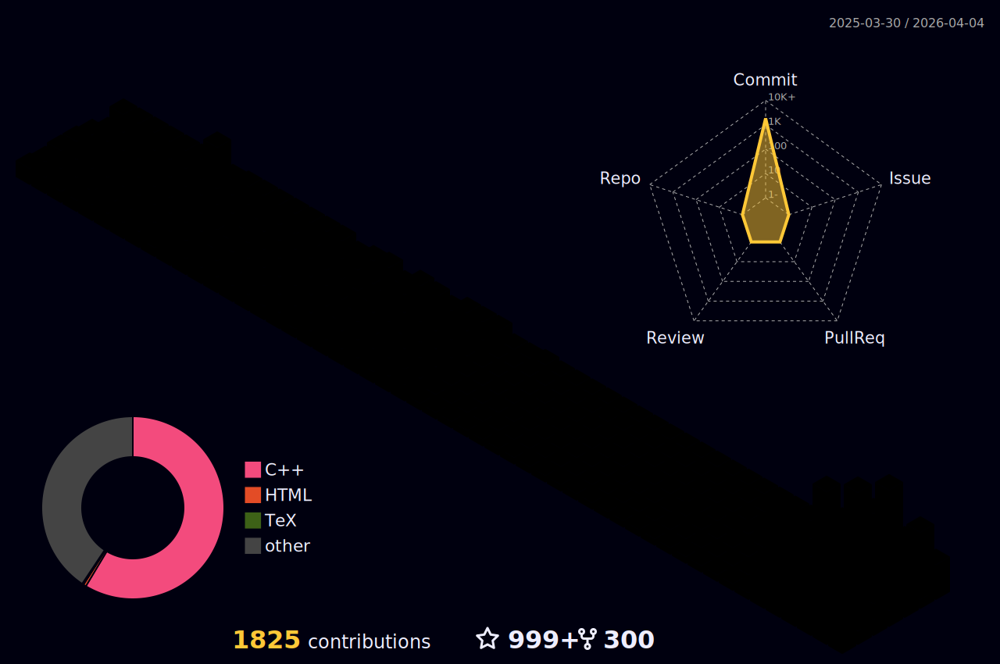

<h1 align="center">
  
  𝐇𝐞𝐥𝐥𝐨, &lt;𝚌𝚘𝚍𝚎𝚛𝚜/&gt;!
  
</h1>

<br/>
<br/>


- 🔭 𝙸’𝚖 𝚌𝚞𝚛𝚛𝚎𝚗𝚝𝚕𝚢 𝚠𝚘𝚛𝚔𝚒𝚗𝚐 𝚘𝚗 **Spring Boot 𝚊𝚗𝚍 𝚆𝚎𝚋 𝙳𝚎𝚟𝚎𝚕𝚘𝚙𝚖𝚎𝚗𝚝.**
- 🌱 𝙸’𝚖 𝚌𝚞𝚛𝚛𝚎𝚗𝚝𝚕𝚢 𝚕𝚎𝚊𝚛𝚗𝚒𝚗𝚐 **𝙳𝚎𝚟𝙾𝚙𝚜 𝚊𝚗𝚍 𝙲𝚘𝚖𝚙𝚎𝚝𝚒𝚝𝚒𝚟𝚎 𝙿𝚛𝚘𝚐𝚛𝚊𝚖𝚖𝚒𝚗𝚐.**
- 👯 𝙸’𝚖 𝚕𝚘𝚘𝚔𝚒𝚗𝚐 𝚝𝚘 𝚌𝚘𝚕𝚕𝚊𝚋𝚘𝚛𝚊𝚝𝚎 𝚘𝚗 **𝙰𝚗𝚍𝚛𝚘𝚒𝚍, 𝙳𝚊𝚝𝚊 𝚂𝚌𝚒𝚎𝚗𝚌𝚎 𝚘𝚛 𝚆𝚎𝚋 𝙳𝚎𝚟𝚎𝚕𝚘𝚙𝚖𝚎𝚗𝚝.**
- 💬 𝙰𝚜𝚔 𝙼𝚎 𝙰𝚋𝚘𝚞𝚝 𝙰𝚗𝚢𝚝𝚑𝚒𝚗𝚐 [here](https://github.com/JayantGoel001/JayantGoel001/issues/1) ! 𝙸 𝚊𝚖 𝚑𝚊𝚙𝚙𝚢 𝚝𝚘 𝚑𝚎𝚕𝚙.
- 😄 𝙿𝚛𝚘𝚗𝚘𝚞𝚗𝚜 : **𝙷𝚎/𝙷𝚒𝚖/𝙷𝚒𝚜.**
- ⚡ 𝙵𝚞𝚗 𝚏𝚊𝚌𝚝 : **𝙱𝚎𝚜𝚝 𝙿𝚊𝚛𝚝 𝙾𝚏 𝚃𝚑𝚎 𝙹𝚘𝚞𝚛𝚗𝚎𝚢 𝙸𝚜 : *𝙸𝚝 𝙴𝚗𝚍𝚜.***

<br/>
<br/>


<p align="center">
   •   
  <a href="https://user-badge.committers.top/india_private/JayantGoel001"></a> •
   •
   •
  <a href="https://github.com/sponsors/JayantGoel001"></a>
</p>
<!-- <p align="center">
  <code>
    
  </code>
</p> -->

#


<p align="center">
  
  
  
</p>

#


<br/>

**𝙻𝙰𝙽𝙶𝚄𝙰𝙶𝙴𝚂 𝙰𝙽𝙳 𝚃𝙾𝙾𝙻𝚂:**  

<br/>
<br/>


<code></code>
<code></code>
<code></code>
<code></code>
<code></code>
<code></code>
<code></code>
<code></code>
<code></code>

#

<code></code>
<code></code>
<code></code>
<code></code>
<code></code>
<code></code>
<code></code>
<code></code>
<code></code>


<br/>

#

<details open="">
<summary>
  <g-emoji class="g-emoji" alias="chart_with_upwards_trend" fallback-src="https://github.githubassets.com/images/icons/emoji/unicode/1f4c8.png">📈</g-emoji>
  <strong>𝙶𝚒𝚝𝚑𝚞𝚋 𝚂𝚝𝚊𝚝𝚜 : </strong>
</summary>
<br/>

<p align="center">
    
    
</p>
</details>
<br/>




<h4 align="center">
  
```diff
+@ @ @ @ @ @ @ @ @ @ @ @ @ @ @ @ @ @ @ @ @ @ @ @ @ @ @ @+
@@       o o                                           @@
@@       | |                                           @@
@@      _L_L_                                          @@
@@   ❮\/__-__\/❯ Programming isn't about what you know @@
@@   ❮(|~o.o~|)❯  It's about what you can figure out   @@
@@   ❮/ \`-'/ \❯                                       @@
@@     _/`U'\_                                         @@
@@    ( .   . )     .----------------------------.     @@
@@   / /     \ \    | while( ! (succeed=try() ) ) |     @@
@@   \ |  ,  | /    '----------------------------'     @@
@@    \|=====|/                                        @@
@@     |_.^._|                                         @@
@@     | |"| |                                         @@
@@     ( ) ( )   Testing leads to failure              @@
@@     |_| |_|   and failure leads to understanding    @@
@@ _.-' _j L_ '-._                                     @@
@@(___.'     '.___)                                    @@
+@ @ @ @ @ @ @ @ @ @ @ @ @ @ @ @ @ @ @ @ @ @ @ @ @ @ @ @+
```

</h4>  
  


<br/>

#

<summary>
  <g-emoji class="g-emoji" alias="chart_with_upwards_trend" fallback-src="https://github.githubassets.com/images/icons/emoji/unicode/1f4c8.png">📈</g-emoji>
  <strong>𝚆𝚊𝚔𝚊𝚃𝚒𝚖𝚎 𝚂𝚝𝚊𝚝𝚜 : </strong>
</summary>


<br>
<br>

<!--START_SECTION:waka-->


**🐱 My GitHub Data** 

> 📦 14.1 MB Used in GitHub's Storage 
 > 
> 🏆 6,129 Contributions in the Year 2024
 > 
> 💼 Opted to Hire
 > 
> 📜 208 Public Repositories 
 > 
> 🔑 0 Private Repositories 
 > 
**I'm a Night 🦉** 

```text
🌞 Morning                15800 commits       ████░░░░░░░░░░░░░░░░░░░░░   17.63 % 
🌆 Daytime                24700 commits       ███████░░░░░░░░░░░░░░░░░░   27.56 % 
🌃 Evening                31856 commits       █████████░░░░░░░░░░░░░░░░   35.54 % 
🌙 Night                  17269 commits       █████░░░░░░░░░░░░░░░░░░░░   19.27 % 
```
📅 **I'm Most Productive on Sunday** 

```text
Monday                   12499 commits       ███░░░░░░░░░░░░░░░░░░░░░░   13.95 % 
Tuesday                  12538 commits       ███░░░░░░░░░░░░░░░░░░░░░░   13.99 % 
Wednesday                12683 commits       ████░░░░░░░░░░░░░░░░░░░░░   14.15 % 
Thursday                 12485 commits       ███░░░░░░░░░░░░░░░░░░░░░░   13.93 % 
Friday                   12535 commits       ███░░░░░░░░░░░░░░░░░░░░░░   13.99 % 
Saturday                 13045 commits       ████░░░░░░░░░░░░░░░░░░░░░   14.56 % 
Sunday                   13840 commits       ████░░░░░░░░░░░░░░░░░░░░░   15.44 % 
```


📊 **This Week I Spent My Time On** 

```text
🕑︎ Time Zone: Asia/Kolkata

💬 Programming Languages: 
Other                    10 hrs 19 mins      █████████████████████████   100.00 % 

🔥 Editors: 
Chrome                   10 hrs 19 mins      █████████████████████████   100.00 % 

🐱‍💻 Projects: 
spring-graphql-2-jpa     10 hrs 19 mins      █████████████████████████   99.98 % 
JayantGoel001.github.io  0 secs              ░░░░░░░░░░░░░░░░░░░░░░░░░   00.02 % 

💻 Operating System: 
Windows                  10 hrs 19 mins      █████████████████████████   100.00 % 
```

**I Mostly Code in Jupyter Notebook** 

```text
C++                      20 repos            ███░░░░░░░░░░░░░░░░░░░░░░   13.70 % 
JavaScript               11 repos            ██░░░░░░░░░░░░░░░░░░░░░░░   07.53 % 
Dockerfile               2 repos             ░░░░░░░░░░░░░░░░░░░░░░░░░   01.37 % 
TeX                      1 repo              ░░░░░░░░░░░░░░░░░░░░░░░░░   00.68 % 
R                        1 repo              ░░░░░░░░░░░░░░░░░░░░░░░░░   00.68 % 
```


 Last Updated on 29/06/2024 02:10:07 UTC
<!--END_SECTION:waka-->

<p align="center">
  
  
</p>

#

<p align="center">
    
  <h4 align="center"><code>📊 𝙶𝚒𝚝𝙷𝚞𝚋 𝙼𝚎𝚝𝚛𝚒𝚌𝚜</code></h4>
</p>

<p align="center">
  
  
</p>

<h1>
  Connect With Me
  
</h1>

<p align="center">
  <br>
  <a href="https://www.linkedin.com/in/JayantGoel001/" target="_blank">
    <code></code>
  </a>
  <a href="https://www.facebook.com/jayantgoel001/" target="_blank">
    <code></code>
  </a>
  <a href="https://www.instagram.com/jayantgoel001/" target="_blank">
    <code></code>
  </a>
  <a href="https://twitter.com/JayantGoel001" target="_blank">
    <code></code>
  </a>
  <a href="https://dev.to/jayantgoel001">
    <code></code>
  </a>     
</p>
<br/>

<p align="center">
  <a href="https://www.hackerrank.com/JayantGoel001/" target="_blank">
    <code></code>
  </a>

  <a href="http://www.codeforces.com/profile/JayantGoel001" target="_blank">
    <code></code>
  </a>

  <a href="https://www.hackerearth.com/@jayantgoel001" target="_blank">
    <code></code>
  </a>

  <a href="https://www.codechef.com/users/jayantgoel001" target="_blank">
    <code></code>
  </a>
  
  <a href="https://leetcode.com/JayantGoel001/" target="_blank">
    <code></code>
  </a>
</p>

<br/>
<br/>

<div align="center">

### 𝚂𝚑𝚘𝚠 𝚜𝚘𝚖𝚎 ❤️ 𝚋𝚢 𝚜𝚝𝚊𝚛𝚛𝚒𝚗𝚐 𝚜𝚘𝚖𝚎 𝚘𝚏 𝚝𝚑𝚎 𝚛𝚎𝚙𝚘𝚜𝚒𝚝𝚘𝚛𝚒𝚎𝚜!

</div>

#


