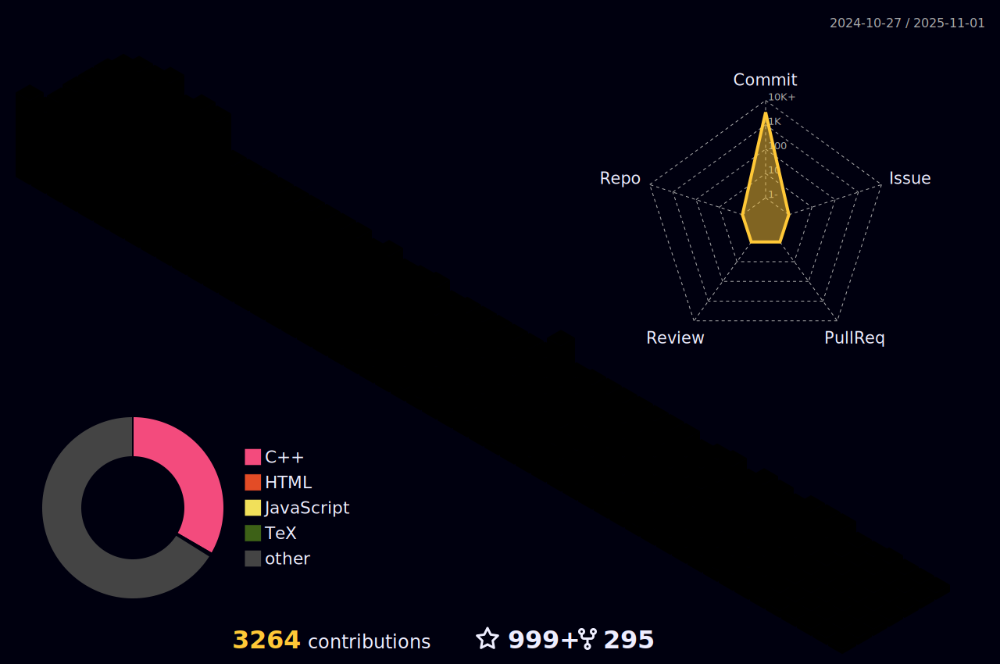

<h1 align="center">
  
  𝐇𝐞𝐥𝐥𝐨, &lt;𝚌𝚘𝚍𝚎𝚛𝚜/&gt;!
  
</h1>

<br/>
<br/>


- 🔭 𝙸’𝚖 𝚌𝚞𝚛𝚛𝚎𝚗𝚝𝚕𝚢 𝚠𝚘𝚛𝚔𝚒𝚗𝚐 𝚘𝚗 **𝙳𝚊𝚝𝚊 𝚂𝚌𝚒𝚎𝚗𝚌𝚎 𝚊𝚗𝚍 𝚆𝚎𝚋 𝙳𝚎𝚟𝚎𝚕𝚘𝚙𝚖𝚎𝚗𝚝.**
- 🌱 𝙸’𝚖 𝚌𝚞𝚛𝚛𝚎𝚗𝚝𝚕𝚢 𝚕𝚎𝚊𝚛𝚗𝚒𝚗𝚐 **𝙳𝚎𝚟𝙾𝚙𝚜 𝚊𝚗𝚍 𝙲𝚘𝚖𝚙𝚎𝚝𝚒𝚝𝚒𝚟𝚎 𝙿𝚛𝚘𝚐𝚛𝚊𝚖𝚖𝚒𝚗𝚐.**
- 👯 𝙸’𝚖 𝚕𝚘𝚘𝚔𝚒𝚗𝚐 𝚝𝚘 𝚌𝚘𝚕𝚕𝚊𝚋𝚘𝚛𝚊𝚝𝚎 𝚘𝚗 **𝙰𝚗𝚍𝚛𝚘𝚒𝚍, 𝙳𝚊𝚝𝚊 𝚂𝚌𝚒𝚎𝚗𝚌𝚎 𝚘𝚛 𝚆𝚎𝚋 𝙳𝚎𝚟𝚎𝚕𝚘𝚙𝚖𝚎𝚗𝚝.**
- 💬 𝙰𝚜𝚔 𝙼𝚎 𝙰𝚋𝚘𝚞𝚝 𝙰𝚗𝚢𝚝𝚑𝚒𝚗𝚐 [here](https://github.com/JayantGoel001/JayantGoel001/issues/1) ! 𝙸 𝚊𝚖 𝚑𝚊𝚙𝚙𝚢 𝚝𝚘 𝚑𝚎𝚕𝚙.
- 😄 𝙿𝚛𝚘𝚗𝚘𝚞𝚗𝚜 : **𝙷𝚎/𝙷𝚒𝚖/𝙷𝚒𝚜.**
- ⚡ 𝙵𝚞𝚗 𝚏𝚊𝚌𝚝 : **𝙱𝚎𝚜𝚝 𝙿𝚊𝚛𝚝 𝙾𝚏 𝚃𝚑𝚎 𝙹𝚘𝚞𝚛𝚗𝚎𝚢 𝙸𝚜 : *𝙸𝚝 𝙴𝚗𝚍𝚜.***

<br/>
<br/>


<p align="center">
   •  
<!--    •    -->
   •   
  
</p>
<!-- <p align="center">
  <code>
    
  </code>
</p> -->

#


<p align="center">
  
  
  
</p>

#


<br/>

**𝙻𝙰𝙽𝙶𝚄𝙰𝙶𝙴𝚂 𝙰𝙽𝙳 𝚃𝙾𝙾𝙻𝚂:**  

<br/>
<br/>

<a align= "center">
  <code></code>
  <code></code>
  <code></code>
  <code></code>
  <code></code>
  <code></code>
  <code></code>
  <code></code>
  <code></code>
</a>

#

<a align = "center"> 
  <code></code>
  <code></code>
  <code></code>
  <code></code>
  <code></code>
  <code></code>
  <code></code>
  <code></code>
  <code></code>
</a>

<br/>
<br/>
<br/>

#

<details open="">
<summary>
  <g-emoji class="g-emoji" alias="chart_with_upwards_trend" fallback-src="https://github.githubassets.com/images/icons/emoji/unicode/1f4c8.png">📈</g-emoji>
  <strong>𝙶𝚒𝚝𝚑𝚞𝚋 𝚂𝚝𝚊𝚝𝚜 : </strong>
</summary>
<br/>

<p align="center">
    
    
</p>
</details>
<br/>




<h4 align="center">
  
```diff
+@ @ @ @ @ @ @ @ @ @ @ @ @ @ @ @ @ @ @ @ @ @ @ @ @ @ @ @+
@@       o o                                           @@
@@       | |                                           @@
@@      _L_L_                                          @@
@@   ❮\/__-__\/❯ Programming isn't about what you know @@
@@   ❮(|~o.o~|)❯  It's about what you can figure out   @@
@@   ❮/ \`-'/ \❯                                       @@
@@     _/`U'\_                                         @@
@@    ( .   . )     .----------------------------.     @@
@@   / /     \ \    | while( ! (succed=try() ) ) |     @@
@@   \ |  ,  | /    '----------------------------'     @@
@@    \|=====|/                                        @@
@@     |_.^._|                                         @@
@@     | |"| |                                         @@
@@     ( ) ( )   Testing leads to failure              @@
@@     |_| |_|   and failure leads to understanding    @@
@@ _.-' _j L_ '-._                                     @@
@@(___.'     '.___)                                    @@
+@ @ @ @ @ @ @ @ @ @ @ @ @ @ @ @ @ @ @ @ @ @ @ @ @ @ @ @+
```

</h4>  
  


<br/>

#

<summary>
  <g-emoji class="g-emoji" alias="chart_with_upwards_trend" fallback-src="https://github.githubassets.com/images/icons/emoji/unicode/1f4c8.png">📈</g-emoji>
  <strong>𝚆𝚊𝚔𝚊𝚃𝚒𝚖𝚎 𝚂𝚝𝚊𝚝𝚜 : </strong>
</summary>


<br>
<br>

<!--START_SECTION:waka-->


**🐱 My GitHub Data** 

> 🏆 13,601 Contributions in the Year 2022
 > 
> 📦 8.5 MB Used in GitHub's Storage 
 > 
> 🚫 Not Opted to Hire
 > 
> 📜 239 Public Repositories 
 > 
> 🔑 0 Private Repositories  
 > 
**I'm an Early 🐤** 

```text
🌞 Morning    129 commits    █████░░░░░░░░░░░░░░░░░░░░   20.22% 
🌆 Daytime    265 commits    ██████████░░░░░░░░░░░░░░░   41.54% 
🌃 Evening    111 commits    ████░░░░░░░░░░░░░░░░░░░░░   17.4% 
🌙 Night      133 commits    █████░░░░░░░░░░░░░░░░░░░░   20.85%

```
📅 **I'm Most Productive on Wednesday** 

```text
Monday       66 commits     ██░░░░░░░░░░░░░░░░░░░░░░░   10.34% 
Tuesday      76 commits     ███░░░░░░░░░░░░░░░░░░░░░░   11.91% 
Wednesday    162 commits    ██████░░░░░░░░░░░░░░░░░░░   25.39% 
Thursday     82 commits     ███░░░░░░░░░░░░░░░░░░░░░░   12.85% 
Friday       86 commits     ███░░░░░░░░░░░░░░░░░░░░░░   13.48% 
Saturday     92 commits     ███░░░░░░░░░░░░░░░░░░░░░░   14.42% 
Sunday       74 commits     ███░░░░░░░░░░░░░░░░░░░░░░   11.6%

```


📊 **This Week I Spent My Time On** 

```text
⌚︎ Time Zone: Asia/Kolkata

💬 Programming Languages: 
Other                    39 hrs 38 mins      █████████████████████████   100.0%

🔥 Editors: 
Browser                  39 hrs 38 mins      █████████████████████████   100.0%

🐱‍💻 Projects: 
search_engine            39 hrs 38 mins      █████████████████████████   100.0%

💻 Operating System: 
Windows                  39 hrs 38 mins      █████████████████████████   100.0%

```

**I Mostly Code in Python** 

```text
Python                   20 repos            █████░░░░░░░░░░░░░░░░░░░░   20.41% 
Jupyter Notebook         19 repos            ████░░░░░░░░░░░░░░░░░░░░░   19.39% 
C++                      13 repos            ███░░░░░░░░░░░░░░░░░░░░░░   13.27% 
HTML                     10 repos            ██░░░░░░░░░░░░░░░░░░░░░░░   10.2% 
JavaScript               10 repos            ██░░░░░░░░░░░░░░░░░░░░░░░   10.2%

```


 Last Updated on 19/05/2022 02:48:44 UTC
<!--END_SECTION:waka-->

<p align="center">
  
  
</p>

#

<p align="center">
    
  <h4 align="center"><code>📊 𝙶𝚒𝚝𝙷𝚞𝚋 𝙼𝚎𝚝𝚛𝚒𝚌𝚜</code></h4>
</p>

<p align="center">
  
  
</p>

<h1>
  Connect With Me
  
</h1>

<p align="center">
  <br>
  <a href="https://www.linkedin.com/in/JayantGoel001/" target="_blank">
    <code></code>
  </a>
  <a href="https://www.facebook.com/jayant.goel.12/" target="_blank">
    <code></code>
  </a>
  <a href="https://www.instagram.com/jayantgoel001/" target="_blank">
    <code></code>
  </a>
  <a href="https://twitter.com/JayantGoel001" target="_blank">
    <code></code>
  </a>
  <a href="https://dev.to/jayantgoel001">
    <code></code>
  </a>     
</p>
<br/>

<p align="center">
  <a href="https://www.hackerrank.com/JayantGoel001/" target="_blank">
    <code></code>
  </a>

  <a href="http://www.codeforces.com/profile/JayantGoel001" target="_blank">
    <code></code>
  </a>

  <a href="https://www.hackerearth.com/@jayantgoel001" target="_blank">
    <code></code>
  </a>

  <a href="https://www.codechef.com/users/jayantgoel001" target="_blank">
    <code></code>
  </a>
  
  <a href="https://leetcode.com/JayantGoel001/" target="_blank">
    <code></code>
  </a>
</p>

<br/>
<br/>

<div align="center">

### 𝚂𝚑𝚘𝚠 𝚜𝚘𝚖𝚎 ❤️ 𝚋𝚢 𝚜𝚝𝚊𝚛𝚛𝚒𝚗𝚐 𝚜𝚘𝚖𝚎 𝚘𝚏 𝚝𝚑𝚎 𝚛𝚎𝚙𝚘𝚜𝚒𝚝𝚘𝚛𝚒𝚎𝚜!

</div>

#


